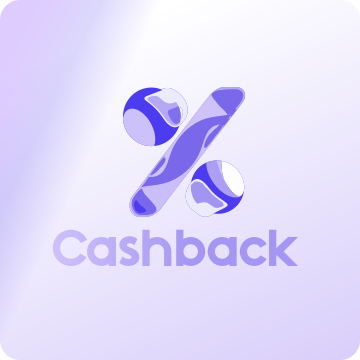

<div align="center">
  
  <h1>Nology Cashback</h1>
  <p>Sistema de cashback desenvolvido como desafio técnico para a empresa Nology</p>
  
  
  
  
  
  
  
</div>

---

## Sobre o Projeto

O **Nology Cashback** é um sistema completo de cálculo e gerenciamento de cashback desenvolvido como desafio técnico para a empresa Nology. O projeto demonstra a implementação de uma arquitetura monorepo moderna, combinando uma API robusta em Python com um frontend interativo em React.

### Arquitetura

O projeto utiliza uma arquitetura monorepo que integra:

- **Backend (API)**: Desenvolvido em Python com FastAPI, responsável pelo processamento de regras de negócio, cálculo de cashback e persistência de dados em PostgreSQL
- **Frontend (Web)**: Single Page Application (SPA) construída com React e TypeScript, oferecendo interface intuitiva para cálculo e consulta de histórico

**Característica Principal**: A API serve o frontend via StaticFiles do FastAPI, proporcionando uma URL única de acesso, eliminando problemas de CORS e simplificando o deployment.

---

## Pré-requisitos

Para executar o projeto localmente, você precisa ter instalado:

- **Docker**: Plataforma de containerização
- **Docker Compose**: Ferramenta para orquestração de containers

---

## Como Executar

Siga os passos abaixo para executar o projeto localmente:

```bash
# Clone o repositório
git clone <repository-url>
cd desafio-nology-2026-04

# Configure as variáveis de ambiente
cp .env.example .env

# Execute com Docker Compose
docker-compose up --build
```

Após a execução bem-sucedida, acesse:

- **Frontend**: [http://localhost:8000](http://localhost:8000)
- **Documentação Interativa da API**: [http://localhost:8000/docs](http://localhost:8000/docs)
- **Health Check**: [http://localhost:8000/health](http://localhost:8000/health)

Para parar os containers:

```bash
docker-compose down
```

---

## Variáveis de Ambiente

O projeto utiliza as seguintes variáveis de ambiente, configuradas no arquivo `.env`:

| Variável          | Descrição                                     | Valor Padrão                                           | Obrigatório |
| ----------------- | --------------------------------------------- | ------------------------------------------------------ | ----------- |
| POSTGRES_USER     | Nome de usuário do PostgreSQL                 | postgres                                               | Sim         |
| POSTGRES_PASSWORD | Senha do PostgreSQL                           | postgres                                               | Sim         |
| POSTGRES_DB       | Nome do banco de dados                        | nology_db                                              | Sim         |
| DB_PORT           | Porta do PostgreSQL                           | 5432                                                   | Não         |
| DATABASE_URL      | URL completa de conexão com o banco de dados  | postgresql://postgres:postgres@db:5432/nology_cashback | Sim         |
| PYTHON_ENV        | Ambiente de execução (development/production) | development                                            | Não         |
| DEBUG             | Ativa modo de debug                           | true                                                   | Não         |
| API_PORT          | Porta do servidor da API                      | 8000                                                   | Não         |

---

## Estrutura do Projeto

```
nology-cashback/
├── api/                    # Backend FastAPI
│   ├── src/
│   │   ├── core/          # Configurações e database
│   │   ├── modules/       # Módulos da aplicação (cashback, health)
│   │   ├── web/           # Frontend build (servido pela API)
│   │   └── main.py        # Entry point da aplicação
│   ├── Dockerfile
│   ├── pyproject.toml
│   └── README.md          # Documentação detalhada da API
├── web/                   # Frontend React
│   ├── src/
│   │   ├── modules/       # Features da aplicação
│   │   ├── components/    # Componentes reutilizáveis
│   │   ├── api/           # Cliente API gerado
│   │   └── main.tsx       # Entry point do React
│   ├── package.json
│   └── README.md          # Documentação detalhada do frontend
├── docker-compose.yml     # Orquestração de containers
├── .env.example           # Exemplo de variáveis de ambiente
└── README.md              # Este arquivo
```

---

## Tecnologias Utilizadas

### Backend

- **Python 3.14**: Linguagem de programação
- **FastAPI 0.135**: Framework web moderno e de alta performance
- **SQLModel 0.0.38**: ORM type-safe para PostgreSQL
- **Uvicorn 0.44**: Servidor ASGI de alta performance
- **PostgreSQL 16**: Banco de dados relacional
- **uv**: Gerenciador de dependências Python rápido e confiável

### Frontend

- **React 19.2.4**: Biblioteca para construção de interfaces
- **TypeScript 6.0.2**: Superset JavaScript com tipagem estática
- **Vite 8.0.4**: Build tool e dev server de próxima geração
- **TanStack Query 5.99.0**: Gerenciamento de estado do servidor
- **shadcn/ui 4.2.0**: Biblioteca de componentes acessíveis
- **Tailwind CSS 4.2.2**: Framework CSS utility-first
- **Axios 1.15.0**: Cliente HTTP
- **React Hook Form 7.72.1**: Gerenciamento de formulários
- **Zod 4.3.6**: Validação de schemas TypeScript-first

### DevOps

- **Docker**: Containerização da aplicação
- **Docker Compose**: Orquestração de containers (API + PostgreSQL)
- **Node 20**: Runtime JavaScript para build do frontend

---

## Documentação Adicional

Para informações mais detalhadas sobre cada camada do projeto, consulte:

- **[API Documentation](api/README.md)**: Arquitetura backend, regras de negócio, endpoints e estrutura do código
- **[Frontend Documentation](web/README.md)**: Arquitetura frontend, integração com API e processo de build

---
